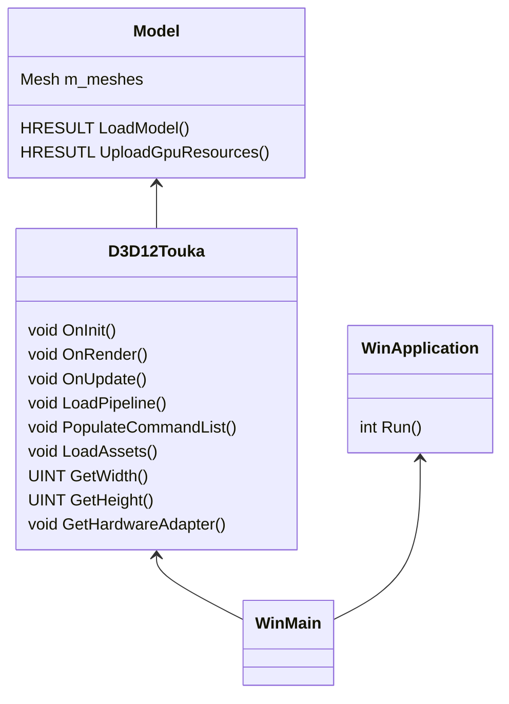

```mermaid
classDiagram
  class WinMain
  class D3D12Touka
  class WinApplication
  class Model

  Model <-- D3D12Touka  
  D3D12Touka <-- WinMain
  WinApplication <-- WinMain

  class D3D12Touka{
    void OnInit()
    void OnRender()
    void OnUpdate()
    void LoadPipeline()
    void PopulateCommandList()
    void LoadAssets()
    UINT GetWidth()
    UINT GetHeight()
    void GetHardwareAdapter()
  }

  class WinApplication{
    int Run()
  }

  class Model{
    Mesh m_meshes
    HRESULT LoadModel()
    HRESUTL UploadGpuResources()
  }

```